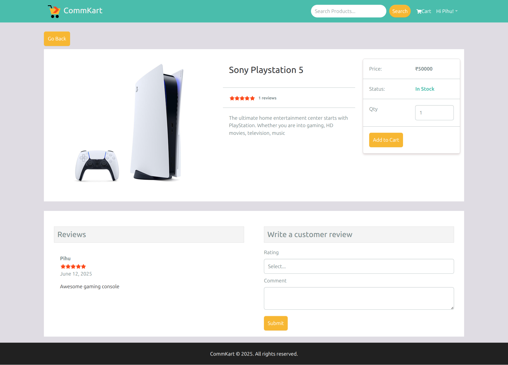

# CommKart e-Commerce Application

> A modern e-commerce platform built for seamless online shopping experience built with MERN stack.





<!-- toc -->

- [About](#about)
- [Features](#features)
- [Tech Stack](#tech-stack)
- [Installation](#installation)
- [Contributing](#contributing)

<!-- tocstop -->

## About

CommKart is a full-featured e-commerce web application that provides users with a comprehensive online shopping experience. The platform includes product browsing, shopping cart functionality, user authentication, order management, and secure payment processing.

## Features

- **User Authentication**: Secure login and registration system with OTP functionality
- **Product Catalog**: Browse products with advanced filtering and search
- **Shopping Cart**: Add, remove, and modify items in cart
- **Checkout Process**: Streamlined checkout with multiple payment options
- **Order Management**: Track orders and view order history
- **Admin Panel**: Manage products, users, and orders
- **Responsive Design**: Mobile-friendly interface
- **Payment Integration**: Secure payment processing
- **Inventory Management**: Real-time stock tracking
- **User Reviews**: Product rating and review system

## Tech Stack

### Frontend:

- React.js / HTML5 / CSS3 / JavaScript
- Bootstrap / Tailwind CSS
- Redux (for state management)

### Backend:

- Node.js / Express.js
- MongoDB / MySQL
- JWT (JSON Web Tokens)

### Payment:

- PayPal (Only USD payments due to domestic transactions being not supported in India)
- Razorpay

### Other Tools:
- Git & GitHub
- Postman (API testing)

## Installation

### Prerequisites

Make sure you have the following installed:

- Node.js (v14 or higher)
- npm or yarn
- MongoDB/MySQL
- Git

#### Steps

1) Clone the repository

```bash 
git clone https://github.com/shresthrajgupta/commkart.git
cd commkart
```

2) Install dependencies

```bash
# Install backend dependencies
npm install

# Install frontend dependencies (if separate frontend folder)
cd client
npm install
cd ..
```
3) Environment Variables

Create a .env file from .env.example in the root directory and add mentioned keys.

4) Seed Data

You can use the following commands to seed the database with some sample users and products as well as destroy all data placed placed in `server/data`.

```bash
# Destroy existing data then import data
npm run data:import

# Destroy data
npm run data:destroy
```

5) Run the application

```bash
# Development as well as production mode
npm run dev

# Run build
npm run build
```

##  Contributing

I welcome contributions from the community!

## Reference Links

- **Razorpay Integration**: https://www.youtube.com/watch?v=el5bTI6GBQ8&t=75000s